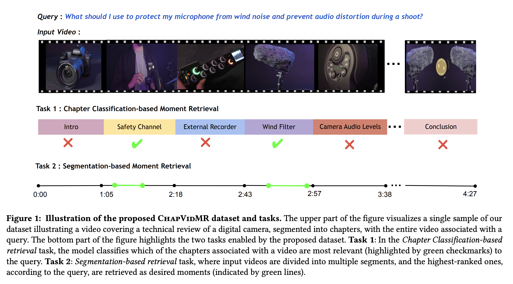
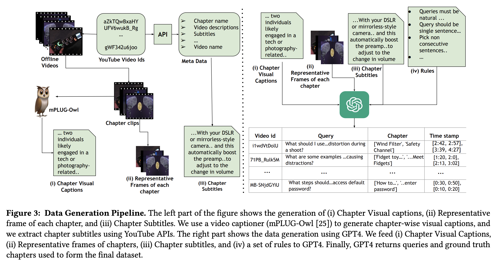
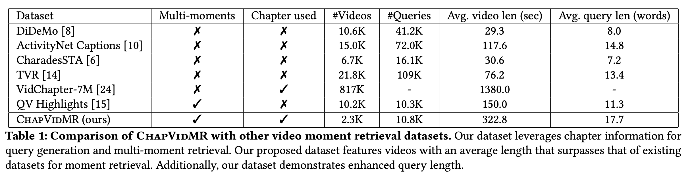
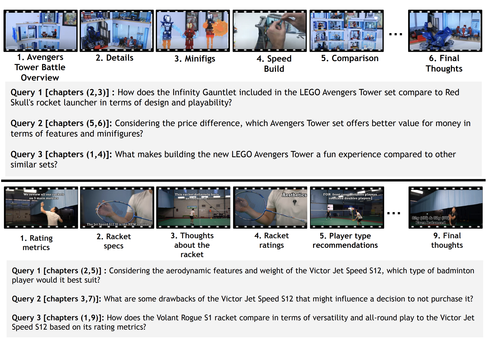
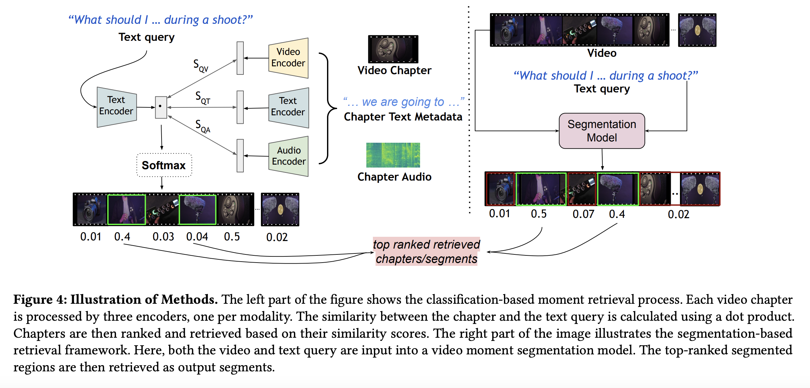

## ChapVidMR: Chapter-Based Video Moment Retrieval using Natural Language Queries | [Paper](https://github.com/vl2g/ChapVidMR/blob/main/figures/ChapVidMR.pdf)

Official Code and Data for our ICVGIP 2024 Paper

This codebase consists of the following three directories:

1) **Data** - This folder consists ChapVidMR dataset and its structure.
2) **Retrieval-VMR** - Contains all the baselines and instructions to run them for the task of classification-based VMR.
3) **Segmentation-VMR** - This consists of all the baselines and instructions to run the same for the task of segmentation-based VMR.

---

## Tasks



---

## Dataset Generation Pipeline



---

## Dataset Stats
Summary statistics for the ChapVidMR dataset.



---

## Dataset Samples




---

## Methods
Description of methods used for the task.



---
## Citation

If you use this code or dataset in your research, please cite our paper:

```bibtex
@inproceedings{chapvidmr,
  author       = {Uday Agarwal and
                  Yogesh Kumar and
                  Abu Shahid and
                  Prajwal Gatti and
                  Manish Gupta and
                  Anand Mishra},
  title        = {Chapter-Based Video Moment Retrieval using Natural Language Queries},
  booktitle    = {ICVGIP},
  year         = {2024},
}
```
## Contact

Please feel free to open an issue or email us at [agarwaluday@iitj.ac.in](mailto:agarwaluday@iitj.ac.in) / [kumar.204@iitj.ac.in](mailto:kumar.204@iitj.ac.in)


